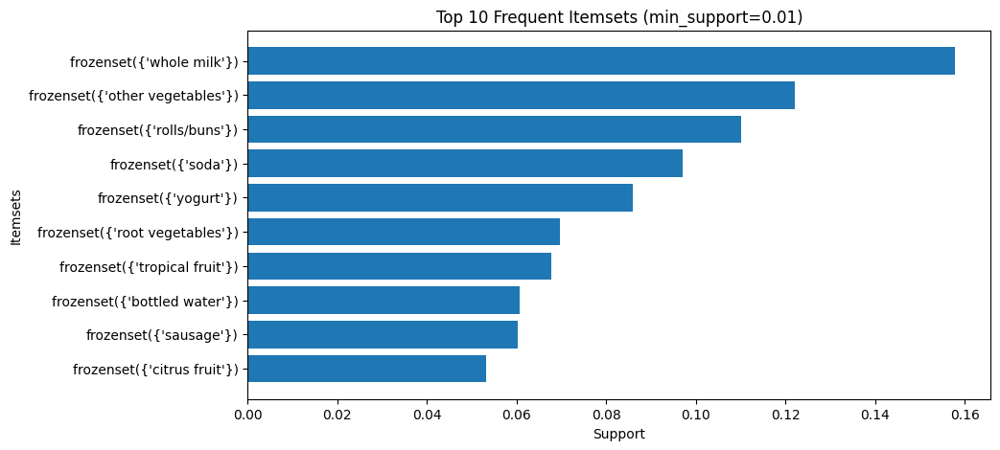

DSA 2040: Data Warehousing and Mining — Association Rule Mining
Author: Abdiqalaq Issack -243
Date: November 2025

1. Dataset Description
Dataset Name: Groceries_dataset.csv
Source: Kaggle — Online Retail Groceries Dataset
Description: Contains transaction-level grocery purchases with the following columns:
Member_number — unique customer ID
Date — transaction date
itemDescription — item purchased
Transactions: ~9835
Unique items: ~169

2. Key Libraries Used
pandas          - data manipulation
mlxtend         - Apriori, FP-Growth, association rules
matplotlib      - visualization
numpy           - numerical operations

3. Data Preparation
Grouped transactions by Member_number + Date to create a unique transaction ID.
Converted transaction lists into a one-hot encoded basket format using TransactionEncoder.
Removed duplicates and missing values during preprocessing.
# Example: Basket creation
transactions = df.groupby('Transaction')['itemDescription'].apply(list).tolist()
te = TransactionEncoder()
te_array = te.fit(transactions).transform(transactions)
basket = pd.DataFrame(te_array, columns=te.columns_)

4. Frequent Itemset Mining
Algorithm: Apriori
Support thresholds: 0.01 (1%) and 0.05 (5%)
Top 10 frequent 1-itemsets (min_support=0.01):
Item	Support
whole milk	0.158
other vegetables	0.122
rolls/buns	0.110
soda	0.097
yogurt	0.086
root vegetables	0.070
tropical fruit	0.068
bottled water	0.061
sausage	0.060
citrus fruit	0.053

Visualization:
import matplotlib.pyplot as plt
top10 = frequent_low.sort_values('support', ascending=False).head(10)
plt.barh(top10['itemsets'].astype(str), top10['support'])
plt.gca().invert_yaxis()
plt.show()

5. Association Rules Generation
Metric: Confidence (min 0.1)
Analysis metrics: Support, Confidence, Lift
Top 3 Rules and Interpretations:
Antecedent	Consequent	Support	Confidence	Lift	Interpretation
yogurt	whole milk	0.0112	0.823	0.823	Yogurt buyers often buy whole milk — breakfast/dairy combination
rolls/buns	whole milk	0.0140	0.127	0.804	Rolls/buns sometimes purchased with milk — breakfast/lunch combos
other vegetables	whole milk	0.0148	0.122	0.769	Vegetable buyers sometimes buy milk — meal preparation insight
Interpretation of metrics:
Support: How frequently a combination occurs
Confidence: How likely the consequent is purchased when the antecedent occurs
Lift: Strength of association compared to random chance
Optional visualization: Scatter plot of Support vs Confidence colored by Lift
plt.scatter(rules['support'], rules['confidence'], c=rules['lift'], cmap='viridis')
plt.colorbar(label='Lift')
plt.xlabel('Support')
plt.ylabel('Confidence')
plt.show()
(Insert screenshot of the plot here)

6. Key Insights
Most frequent items: Whole milk, other vegetables, rolls/buns, and yogurt dominate customer purchases.
Strong associations: Yogurt → Whole milk has high confidence; suitable for cross-promotions.
Marketing opportunities: Meal bundles or combo discounts can be designed based on rules like rolls/buns → sausage, or vegetable → milk.

7. Notes
Dataset cleaned and preprocessed to remove duplicates.
Both Apriori and FP-Growth can be implemented for comparison (optional bonus).
Lowering support and confidence thresholds increases the number of discovered rules.

